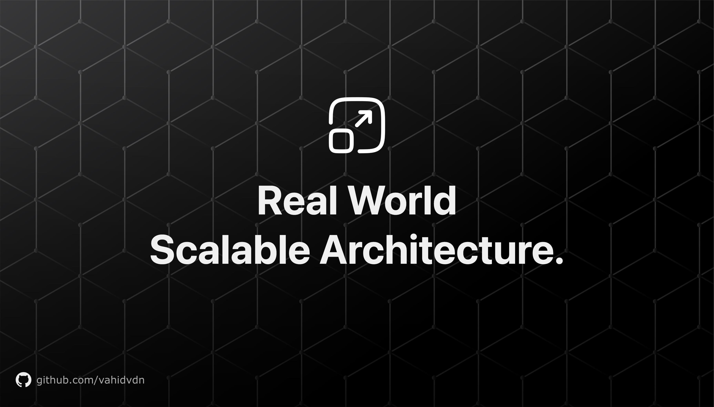

<div align="center">

# Real World Scalable Architecture

Explore real-world scenarios and best practices for scalable architecture in this comprehensive repo.


[](https://github.com/vahidvdn/realworld-design-patterns/compare)


</div>

<hr />


Scalable Architecture Learning Resources — a collection of diagrams, notes, and examples focused on building and operating scalable systems. This site helps you explore topics like distributed systems, cloud infrastructure, observability, caching, data stores, and reliability engineering.


Example Diagram:


## Features

- Curated learning resources on scalable architecture
- Diagrams and visual explanations (see `public/`)
- Fast dev workflow powered by `react-router`
- Production build and optional static deployment

## Getting Started
Visit the learning hub to explore topics, diagrams, and guides:
https://realworld-scalable-architecture.vercel.app/

## Contributing Content

- Add or update materials in `content/docs/`.
- Include diagrams under `public/` and reference them in your content.
- Follow clear, practical examples and link to authoritative external resources.
---

## Run Locally

Run development server:

```bash
npm run dev
# or
pnpm dev
# or
yarn dev
```

Built with ❤️ for the community of engineers learning scalable architecture. Powered by [Fumadocs](https://fumadocs.dev).
